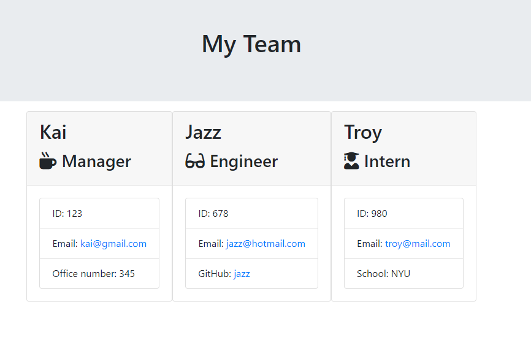

# OOP-team-generator

# My app scope

My app scope is to build a Node CLI that takes in information about employees and generates an HTML webpage that displays summaries for each person. Since testing is a key piece in making code maintainable, I need to ensure that all unit tests pass.

## My appraoch to create the app

* Run tests to evaluate what works and what doesn't work by running [jest npm package](https://jestjs.io/) for the provided tests.

* Create or update classes to pass a single test case. Employee is the parent class/ properties that can be extended to its children - engineer, intern, and manager. this will help us not to repeat the same codes again and again.

* Use [Inquirer npm package](https://github.com/SBoudrias/Inquirer.js/) to prompt the user for their email, id, and specific information based on their role with the company. For instance, an intern may provide their school, whereas an engineer may provide their GitHub username.

* After the user has input all employees desired, call the `render` function and pass in an array containing all employee objects; the `render` function will generate and return a block of HTML including templated divs for each employee.

* Once I have the html, I can create an HTML file using the HTML returned from the `render` function. Now write it to a provided file named `team.html` in the `output` folder. I can use the provided variable `outputPath` above target this location.

* Please find my example of what my app would look like.

## My take on this assignment

This assignment has been very challenging with a lot of new syntax and to grab key ideas of how the back-end development works! Attending office hours does really help to walk me through this assignments step by step and new syntax that I should consider. I also start using more ES6 in my codes. The testing part is very practical to test out each code/function element individually so I understand the whole picture of the back-end development flow. 

